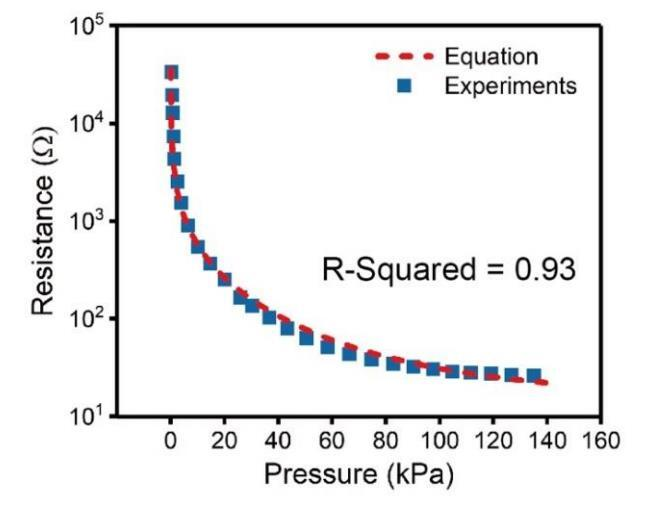
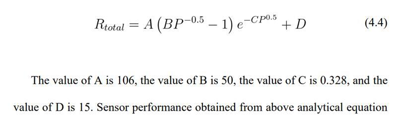

# Telluride21_TAC3
The repository for the project "**Neuromorphic tactile circuit design**" from
Telluride Workshop 2021, under the 
"**TAC21: Neuromorphic tactile sensing for physical interaction and understanding**" Topic

## Contents

* `test_vccs`
A first stab at controlled sources in xschem/ngspice

### sensormodels

* `b_source_magic`  
A realization of a sensor resistance function that Ella Janotte shared:

### playground

* `nfet_03v3_gmtest`  
Christoph Maier's [transistor gm/Id and gm/go characterization simulation environment](https://bitbucket.org/cmucsd/circuitikz-demo/src/master/) (work in progress)
* `ToBias`  
[Constant gm bias circuit](DoNotLitter/biasgenSlides.pdf) with a startup circuit `ToBiasStartup` and test schematic `test_Bias`
* `OgueyAebischerBias`  
A bias circuit without external resistor, based on
[CMOS Current Reference Without Resistance](https://ieeexplore.ieee.org/abstract/document/597305)
with startup circuit `ToBiasStartup` and test schematic `test_OgueyAebischerBias`
* `dividerchain`  
[Current divider chain](DoNotLitter/biasgenSlides.pdf) with `divider` stage and test schematic `test_divider`

 

# Tiny Tapeout Analog Project Template

- [Read the documentation for project](docs/info.md)

## What is Tiny Tapeout?

Tiny Tapeout is an educational project that aims to make it easier and cheaper than ever to get your digital designs manufactured on a real chip.

To learn more and get started, visit https://tinytapeout.com.

## Analog projects

For specifications and instructions, see the [analog specs page](https://tinytapeout.com/specs/analog/).

## Enable GitHub actions to build the results page

- [Enabling GitHub Pages](https://tinytapeout.com/faq/#my-github-action-is-failing-on-the-pages-part)

## Resources

- [FAQ](https://tinytapeout.com/faq/)
- [Digital design lessons](https://tinytapeout.com/digital_design/)
- [Learn how semiconductors work](https://tinytapeout.com/siliwiz/)
- [Join the community](https://tinytapeout.com/discord)

## What next?

- [Submit your design to the next shuttle](https://app.tinytapeout.com/).
- Edit [this README](README.md) and explain your design, how it works, and how to test it.
- Share your project on your social network of choice:
  - LinkedIn [#tinytapeout](https://www.linkedin.com/search/results/content/?keywords=%23tinytapeout) [@TinyTapeout](https://www.linkedin.com/company/100708654/)
  - Mastodon [#tinytapeout](https://chaos.social/tags/tinytapeout) [@matthewvenn](https://chaos.social/@matthewvenn)
  - X (formerly Twitter) [#tinytapeout](https://twitter.com/hashtag/tinytapeout) [@matthewvenn](https://twitter.com/matthewvenn)
